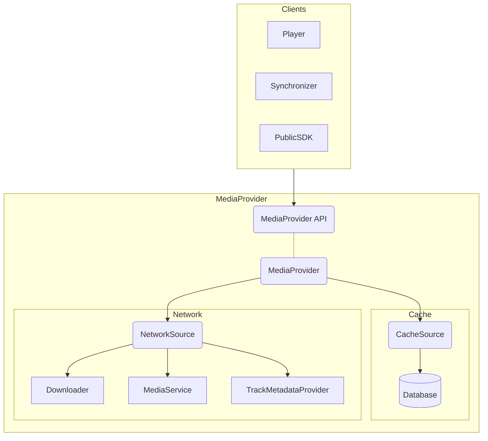

```mermaid
flowchart TD
	MP(MediaProvider)
	MPAPI(MediaProvider API)
	CS(CacheSource)
	DB[(Database)]
	NS(NetworkSource)
	
	subgraph Clients
	    Player
	    Synchronizer
	    PublicSDK
	end
	subgraph MediaProvider
	    MPAPI -.- MP
	    MP --> CS
	    subgraph Cache
	        CS --> DB
	    end
	    MP --> NS
	    subgraph Network
	        NS --> Downloader
	        NS --> MediaService
	        NS --> TrackMetadataProvider
	    end
	end
	Clients --> MPAPI
```

